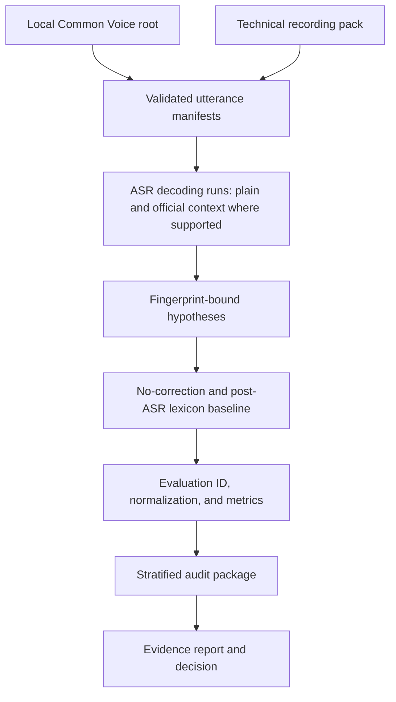
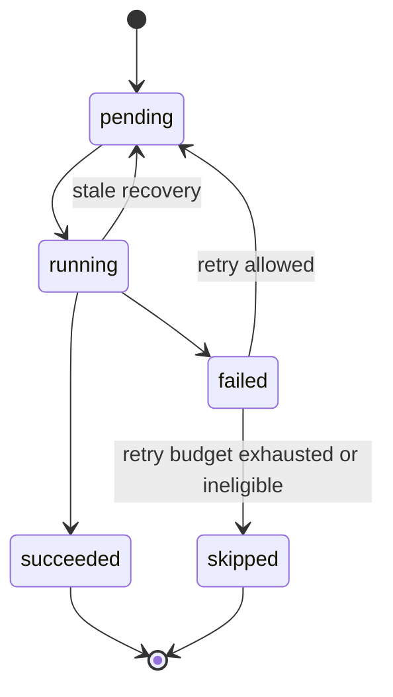
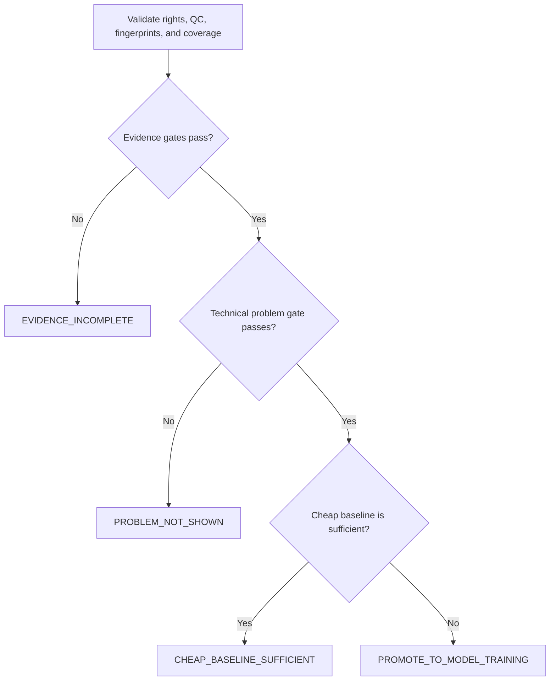
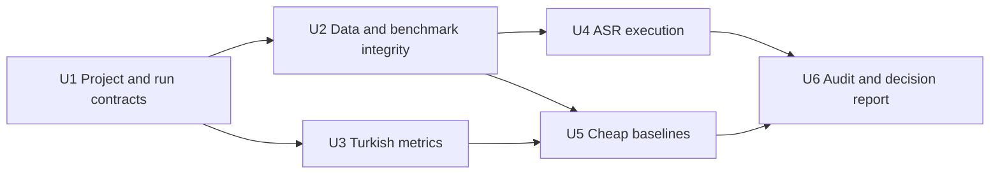

# TTAC Milestone 0 Evidence Pilot - Plan

> **For agentic workers:** Use `superpowers:subagent-driven-development` or `superpowers:executing-plans` to implement this plan unit by unit. Track work outside this document; the checkboxes below are completion criteria, not mutable plan status.

## Goal Capsule

- **Goal:** Build a training-free evidence pilot that determines whether current ASR systems make systematic Turkish technical-term errors and whether cheap context or lexicon baselines solve enough of the problem to make model fine-tuning unnecessary.
- **Architecture:** A small Python package and CLI ingest local audio manifests, run interchangeable ASR adapters through a resumable job ledger, apply conservative baselines, compute fixed metrics, and produce an auditable go/no-go report.
- **Tech stack:** Python 3.11, `uv`, PyTorch-compatible optional ASR environments, SQLite for mutable job state, JSON/JSONL for portable artifacts, `pytest`, Ruff, and mypy.
- **Authority:** This plan governs Milestone 0. `turkish_asr_corrector_project_plan.md` remains the master roadmap for later milestones. If their scopes conflict, this plan controls Milestone 0 only.
- **Execution profile:** Smoke-first and test-first. Real GPU runs begin only after fixture-based tests and the 25-clip resource gate pass.
- **Stop conditions:** Stop data processing when source rights or consent are unclear, benchmark freeze integrity fails, or incompatible transcription fingerprints would be mixed. Low paired coverage does not suppress reporting: produce diagnostic metrics and an `EVIDENCE_INCOMPLETE` report, then repair coverage before drawing a product conclusion.
- **Tail ownership:** Milestone 0 ends with a versioned evidence report and one of the four decisions in R17. It does not end when transcription code merely runs.

---

## Product Contract

### Summary

Milestone 0 will create the smallest trustworthy TTAC experiment: a deterministic general-Turkish sample, a separately frozen human technical pilot, three real ASR adapters plus one deterministic fake test adapter, two cheap correction baselines, conservative Turkish metrics, and a preregistered decision matrix. It will not train a correction model.

### Problem Frame

The master roadmap correctly makes ASR error analysis the first experiment, but its proposed 10,000-clip Common Voice run is too large for an initial resource check and does not directly measure the technical code-switching problem. Common Voice is useful for general Turkish and pipeline validation, while the project's actual value depends on English technical terms with Turkish morphology in human speech.

Milestone 0 must therefore answer three questions before LoRA, ByT5, TTS, or a demo receives effort: Is the target error distribution present? Can the experiment reproduce and audit it? Do inexpensive ASR-context or lexicon methods already solve it without damaging correct text?

### Key Decisions

- **Milestone 0 is a training-free evidence gate.** (session-settled: user-approved — chosen over starting with the roadmap's 10K run or LoRA training: a smaller pilot can invalidate the data and product assumptions at far lower cost.) Governs R1, R2, R14-R17.
- **The pilot measures both general and technical Turkish.** (session-settled: user-approved — chosen over Common Voice-only evidence: the general corpus has almost no specialized-domain coverage.) Governs R1, R2, R14, R16.
- **The technical benchmark is split and frozen before any learned model work.** (session-settled: user-approved — chosen over creating the benchmark after model development: early freezing prevents test-set shaping and term leakage.) Governs R5, R6, R12, R13.

### Requirements

**Evidence inputs**

- R1. The pilot shall deterministically select 100-250 Turkish Common Voice 26 clips from a user-supplied local dataset root and record the acquisition receipt, source version, split, source checksums, filters, seed, selected clip IDs, pseudonymous speaker distribution, and replacement policy without exporting source client IDs or unrestricted metadata.
- R2. The repository shall provide a versioned TTAC technical recording pack with 120 read sentences and 12 short spontaneous prompts, covering technical term families, Turkish suffixes, multi-token brands, version numbers, and negative controls. At least 8 of the 40 frozen-test read sentences shall be negative controls so three eligible speakers provide at least 24 control utterances.
- R3. Raw Common Voice audio, model caches, private human recordings, credentials, absolute source paths, and private utterance-level human transcripts, hypotheses, or audits shall never be tracked by Git; public-safe exports shall use an explicit field allowlist and user-held source data.
- R4. Human recording ingestion shall require pseudonymous speaker IDs, consent status, usage scope, provenance, and QC state in a versioned eligibility manifest whose checksum enters every evaluation. The identity-to-speaker mapping and full consent record shall live in an encrypted or access-controlled private participant registry outside the repository and public artifacts; workers and exporters shall receive only opaque speaker IDs and minimum eligibility fields. A withdrawal shall make the speaker immediately ineligible, move project-held private audio and utterance-level derivatives into access-restricted recovery quarantine for at most 7 days, permanently delete them afterward, allow backup copies to expire within 30 days, retain only a non-identifying exclusion token, and require affected reports to be regenerated. The project shall record deletion verification without retaining deleted content.

**Benchmark integrity**

- R5. Technical content shall be divided into `tech_dev` and `tech_test_frozen` by term family. Threshold and prompt tuning plus the strict unseen-family lexicon shall use only `tech_dev`. The operational domain lexicon shall instead be curated from allowlisted public domain sources, carry source receipts, and be frozen before benchmark sentence authoring; neither lexicon may be updated from frozen references or results.
- R6. A benchmark shall have a pre-recording content freeze followed by `recorded`, `qc_passed`, and a post-QC release freeze; any later text, annotation, reference, or audio change shall create a new content version. Consent or eligibility changes shall create a new checksum-bound eligibility manifest, make reports using the old manifest non-current, and require regeneration without building generalized derivative-lineage or epoch automation in Milestone 0.
- R7. Each technical mention shall carry a canonical term ID, surface span, accepted aliases, term family, category, suffix annotation, and multi-token or version-number metadata.
- R8. Read recordings shall receive complete audio-reference QC; spontaneous recordings shall receive manual transcription and QC rather than using the prompt as a reference. Natural Turkish-accented or Turkishized pronunciation of an intended technical term is valid speech when the intended term is clear; textual misreading and artificial letter-by-letter spelling remain failures. Accepted pronunciation variants and exclusions shall be annotated and reported by speaker and term family.

**Experiment pipeline**

- R9. Every transcription shall produce an immutable manifest and `transcription_run_id` derived from the source, benchmark content, model repository and revision, engine dependency lock, decoding settings including any official context, seed, and device policy. Every downstream scoring/reporting pass shall produce a separate `evaluation_id` derived from hypothesis checksums, eligibility-manifest checksum, normalizer version, baseline configuration, audit dispositions, and frozen decision-gate configuration.
- R10. Every `(transcription_run_id, utterance_id, engine)` job shall have explicit lifecycle, retry count, timing, peak VRAM when available, error reason, and output checksum; empty transcripts shall not be treated as successful or identity examples.
- R11. Interrupted transcription runs shall resume only stale, failed, or missing work and shall never mix outputs from different model revisions, decoding configurations, source fingerprints, or benchmark versions. A normalizer, baseline, audit, eligibility, or decision-gate change shall create a new `evaluation_id` without forcing unchanged audio through ASR again.
- R12. The ASR layer shall support a deterministic fake adapter for tests plus Whisper Small, Whisper Large-v3-Turbo, and Qwen3-ASR-0.6B adapters behind one engine-neutral contract. Whisper Small is the preregistered primary decision lane for Milestone 0; Turbo and Qwen are replication/comparison lanes and cannot independently trigger or veto the primary training decision.
- R13. The cheap-baseline comparison shall include no correction, official local ASR context where supported, and a conservative suffix-aware lexicon/phonetic matcher. Official context is an engine-specific decoding variant executed by the ASR layer under a distinct `transcription_run_id`, never a post-transcription rewrite; unsupported context shall be reported as `not_applicable`, not emulated or treated as failure.

**Measurement and decision**

- R14. The evaluator shall report raw and Turkish-normalized WER/CER, insertions/deletions/substitutions, mention-level canonical and surface term accuracy, suffix preservation, identity damage, orthographic-only changes, improved/unchanged/damaged ratios, coverage, latency, and peak VRAM.
- R15. Before/after comparisons shall use the relevant engine's paired successful utterances. Cross-engine comparisons shall use pairwise successful intersections, while per-engine metrics shall also be reported on each engine's full eligible population. Reports shall retain failures and skipped rows, show coverage and failure counts, and include a preregistered pessimistic bound or failure penalty; the all-engine intersection is secondary only. Coverage below 98% for a decision-bearing lane shall keep diagnostic metrics available but force that lane's conclusion to `EVIDENCE_INCOMPLETE`.
- R16. The audit shall use a deterministic stratified sample across engines, WER bands, identity examples, technical categories, baseline improvements, baseline damage, failures, and suspected reference-quality problems. Because this sample is deliberately enriched, it may verify references and classify errors but shall not estimate problem prevalence or independently trigger model-training promotion.
- R17. The report shall return exactly one decision: `PROBLEM_NOT_SHOWN`, `CHEAP_BASELINE_SUFFICIENT`, `PROMOTE_TO_MODEL_TRAINING`, or `EVIDENCE_INCOMPLETE`, with every gate value and fingerprint recorded.

### Success Criteria

- The software path is deterministic on committed fixtures and can resume after forced interruption without duplicate hypotheses.
- Each ASR engine receives a 25-clip resource result: `PASS`, `PASS_WITH_FALLBACK`, `FAIL_ENVIRONMENT`, `FAIL_OOM`, or `FAIL_MODEL_COMPATIBILITY`.
- Benchmark-grade technical reporting requires at least three speakers, complete read-recording QC, separate per-speaker results, and no population-level generalization claim. Fewer speakers produce development-smoke evidence only.
- A model-training promotion can occur only when the technical problem gate passes, the best cheap baseline remains insufficient, data/QC/resource gates pass, and the thresholds were frozen before viewing `tech_test_frozen` results.
- All generated reports identify exploratory results, incomplete engine comparisons, and assumptions without presenting them as benchmark conclusions.

### Acceptance Examples

- AE1. Covers R6, R11. Given a frozen benchmark, when one reference is corrected, then ingestion rejects an in-place update and requires a new benchmark version before any result can be regenerated.
- AE2. Covers R10, R11. Given a run interrupted with jobs left in `running`, when it resumes after the stale timeout, then only stale or incomplete jobs execute and existing successful output checksums remain unchanged.
- AE3. Covers R13. Given an engine with no official local context mechanism, when the context baseline is requested, then the report records `not_applicable` and still evaluates no-correction and lexicon baselines.
- AE4. Covers R15, R17. Given Whisper Small with 95% eligible coverage, when decision reporting is requested, then metrics remain available for diagnosis but the overall decision is `EVIDENCE_INCOMPLETE`.
- AE5. Covers R7, R14. Given `PyTorch'ta`, `Hugging Face` and `Qwen3.5` mentions, when term metrics run, then surface accuracy, canonical accuracy, and suffix preservation are calculated independently.
- AE6. Covers R5, R13. Given a term that appears only in `tech_test_frozen`, when the context and lexicon configurations are built, then the term cannot be sourced from frozen references or sentence-specific ground truth.
- AE7. Covers R9, R11. Given unchanged hypotheses, when only the normalizer or decision gates change, then a new `evaluation_id` is created without a new `transcription_run_id` or ASR execution.
- AE8. Covers R4. Given a public-safe export or an ASR worker request, when its schema is validated, then direct identity fields, consent documents, and identity-mapping paths are rejected.
- AE9. Covers R8. Given a clearly intended technical term spoken with a natural Turkish accent or common Turkishized pronunciation, when QC runs, then the clip remains eligible with a pronunciation-variant annotation rather than being rejected as a misread.
- AE10. Covers R12, R15, R17. Given complete Whisper Small evidence and a failed Qwen replication lane, when reporting runs, then the primary decision remains available while the Qwen comparison is `INCOMPLETE_RESOURCE`; a failed Whisper Small lane instead yields `EVIDENCE_INCOMPLETE`.

### Scope Boundaries

#### In Scope

- Project scaffold, dependency isolation, configuration, manifests, data validation, deterministic sampling, benchmark authoring pack, ASR adapters, resumable execution, baselines, metrics, audit artifacts, and go/no-go report.
- A small real run sufficient to measure resource use and produce pilot evidence once the user supplies licensed source data and human recordings.

#### Deferred to Follow-Up Work

- The 10,000-clip Common Voice expansion and production dataset construction.
- Qwen QLoRA with Unsloth, ByT5 training, synthetic technical speech, TTS augmentation, and hyperparameter search.
- MediaSpeech and FLEURS evaluation, universal/multi-ASR correction training, larger benchmark collection, ablations, model release, and a polished Gradio demo.
- A publication-grade benchmark with enough speakers for population-level statistical claims.

#### Outside Milestone 0

- Audio-conditioned correction, N-best hypotheses, phonetic confidence features, live streaming correction, cloud ASR APIs, and sentence-specific oracle vocabulary.
- A recording application. Milestone 0 supplies prompts, naming rules, consent templates, and ingestion/QC validation only.

### Risks and Dependencies

- **Common Voice access and reuse:** The user must obtain the dataset under Mozilla Data Collective terms. The implementation accepts a local path and does not bypass access controls or re-host audio.
- **Human participation:** Evidence depends on externally collected recordings. The target is five speakers; three is the minimum for pilot benchmark reporting. Consent does not imply public redistribution.
- **Derived human data:** References, ASR hypotheses, baseline edits, and audit rows can contain personal information even when audio is private. Private-by-default per-speaker storage, export allowlists, the bounded withdrawal/deletion procedure, and full affected-report regeneration apply to every utterance-level derivative.
- **GPU compatibility:** Windows, CUDA, PyTorch, Whisper, and Qwen dependencies can conflict. Optional engine groups and the 25-clip gate prevent one adapter from blocking core development.
- **Small sample uncertainty:** Milestone 0 supports product triage, not broad Turkish-speaker generalization. Results are reported per speaker and per domain.
- **Reference quality:** High WER can reflect a bad reference or misread sentence. QC and stratified audit must separate label problems from ASR errors.
- **Baseline leakage:** The operational lexicon and its source receipts are frozen before sentence authoring; the strict unseen-family lexicon and thresholds are frozen after `tech_dev`. Frozen references cannot contribute sentence-specific terms to either condition.

### Sources

- Master roadmap and project intent: `turkish_asr_corrector_project_plan.md`.
- Common Voice Turkish 26 dataset card and reuse restrictions: [Mozilla Data Collective](https://mozilladatacollective.com/datasets/cmqinosfq00x4nr07gnk0rdf9).
- Whisper `initial_prompt` behavior for custom vocabulary and proper nouns: [OpenAI Whisper transcription implementation](https://github.com/openai/whisper/blob/main/whisper/transcribe.py).
- Qwen3-ASR-0.6B model scope and Turkish support: [Qwen3-ASR-0.6B](https://huggingface.co/Qwen/Qwen3-ASR-0.6B).

---

## Planning Contract

### Key Technical Decisions

- KTD1. **Use a package plus a thin CLI, not a collection of independent scripts.** Shared schema, normalization, adapter, and metric code must have one importable owner and direct tests.
- KTD2. **Use one simple SQLite ledger per run as the sole mutable authority.** A single orchestrator runs at most one worker process per engine at a time and transactionally records job status, retry count, result payload, and checksum. Validated worker results are committed to this ledger; ledger-derived JSON and JSONL exports are immutable checksum-bound snapshots and are never re-imported to advance lifecycle. Milestone 0 deliberately defers competing-worker claims, leases, and attempt fencing until the 10,000-clip expansion demonstrates a concurrency need.
- KTD3. **Isolate ASR engines behind a minimal versioned and constrained JSON request/result contract.** The core orchestrator runs without GPU libraries and invokes one engine subprocess at a time, while Whisper and Qwen may use separate locked environments. Invoke workers with fixed argument arrays and a stripped environment; validate request/result schemas, checksums, sizes, and path containment; provide read-only inputs and a dedicated output directory; pin model revisions and disallow unreviewed remote code; apply time and resource limits; and run offline after verified model acquisition. This avoids forcing mutually incompatible engine stacks into one environment without building a generalized distributed-worker protocol; process isolation is a dependency boundary, not a security sandbox.
- KTD4. **Separate benchmark content identity from participant eligibility and identity with a simple pilot procedure.** A pre-recording content freeze protects term families, split membership, aliases, and annotations; a post-QC release freeze binds audio and references. A checksum-bound eligibility manifest selects speakers for each evaluation. The protected identity/consent registry remains outside the repository and unreadable by ASR workers and public exporters; per-speaker private folders make bounded quarantine/deletion and full report regeneration practical. Keep only a non-identifying exclusion token after withdrawal and defer generalized lineage/epoch automation.
- KTD5. **Compare realistic cheap alternatives with strict unseen-family generalization.** Freeze an externally curated operational domain lexicon before benchmark sentence authoring and use official ASR context where supported; either deployable condition may satisfy the cheap-baseline decision. Separately derive a strict lexicon from `tech_dev` only and report it as a diagnostic unseen-family condition. No condition may use frozen references or sentence-specific terms. The matcher records every proposed edit, candidate, score, threshold, and lexicon version per R5 and R13.
- KTD6. **Treat metrics as derived artifacts.** WER buckets and scores are reproducible from references, hypotheses, baseline outputs, annotations, and an explicit normalizer version; they are not stored as source truth.
- KTD7. **Use the fake adapter as the pipeline proof.** Sequential resume, failure, fingerprint, coverage, worker-contract, and reporting behavior must be verified before any real model download or GPU run.
- KTD8. **Freeze the decision contract before the frozen test run.** Numerical gates live in versioned config and its hash is embedded in the report; changing a gate requires a new `evaluation_id` and rationale, not retranscription when hypotheses are unchanged.
- KTD9. **Keep transcription independent from evaluation.** ASR workers consume validated utterance manifests and emit hypothesis artifacts only; normalization, lexicon matching, metrics, audit, and reporting depend on those artifacts rather than entering the adapter layer. Official ASR context is the sole baseline that remains inside transcription because it changes decoding and therefore receives its own `transcription_run_id`.

### Assumptions

These choices are the resolved Milestone 0 defaults. They must be serialized in the frozen gate configuration and remain visible in the first evidence report.

- Python 3.11 and `uv` are the baseline runtime. The core package, Whisper worker, and Qwen worker use separate `pyproject.toml` and lockfiles so engine dependency conflicts cannot mutate the core environment.
- The Common Voice pilot defaults to 200 clips within R1's allowed range. The resource gate uses 25 diverse clips drawn from general and available technical audio.
- The technical pack defaults to 80 read sentences plus 8 spontaneous prompts in `tech_dev`, and 40 read sentences plus 4 prompts in `tech_test_frozen`.
- Five speakers are the collection target. Three speakers permit pilot benchmark reporting; fewer than three force `EVIDENCE_INCOMPLETE` for the technical decision.
- Whisper Small is the only primary decision lane. Its problem gate is micro-aggregated over every eligible annotated mention in the complete `tech_test_frozen` population and passes when canonical technical-term accuracy is at or below 90%, or that population contains at least 25 verified systematic error instances spanning at least 10 term families and two speakers. Turbo and Qwen results are replication evidence only. The enriched audit validates and classifies errors but cannot supply their prevalence count.
- Official context where supported and the operational domain lexicon are the decision-bearing cheap alternatives; either is sufficient when, on Whisper Small's paired successful frozen-test rows, it corrects at least 50% of the initially incorrect annotated technical mentions without introducing a new canonical error, damages no more than 1% of initially correct annotated mentions, and worsens micro-aggregated normalized WER by no more than 0.5 absolute percentage points on either required control slice: the complete eligible Common Voice pilot and all frozen technical negative-control utterances. The `tech_dev`-only unseen-family lexicon, speaker macro scores, term-category slices, and read/spontaneous slices are diagnostic only.
- Gate denominators, micro aggregation, required slices, and branch order are frozen before `tech_test_frozen` is viewed. A required slice with zero eligible items, a primary-lane paired coverage below 98%, fewer than three eligible speakers, incomplete read QC, or incompatible fingerprints produces `EVIDENCE_INCOMPLETE`; no threshold is interpreted from an undersized or missing required slice.
- Each required WER control slice must contain at least 20 eligible utterances and the identity-damage denominator must contain at least 50 initially correct annotated mentions; otherwise evidence is incomplete. One systematic error instance is one eligible annotated mention with a canonical mismatch, counted once per utterance-term pair after QC/audit confirms it is not a reference or reading error. Failed primary-lane utterances remain failures but are treated as empty hypotheses only in the explicitly labeled pessimistic bound.
- `INCOMPLETE_RESOURCE` is a lane/comparison status, not a fifth R17 decision: on Whisper Small it maps the overall report to `EVIDENCE_INCOMPLETE`, while on Turbo or Qwen it leaves the primary decision intact and marks only the affected replication evidence incomplete.
- Decision precedence is fixed: evidence incompleteness first; otherwise `PROBLEM_NOT_SHOWN` when the Whisper Small problem gate fails; otherwise `CHEAP_BASELINE_SUFFICIENT` when at least one decision-bearing cheap alternative passes every sufficiency gate; otherwise `PROMOTE_TO_MODEL_TRAINING` only when scaling projections support at least 200 high-quality actual-error pairs.
- Statistical output is descriptive at Milestone 0 scale. Paired audio-level bootstrap intervals are allowed, but speaker-population claims require a later benchmark with more speakers.

### High-Level Technical Design

The diagrams are directional. Implementation may refine class and command names while preserving the boundaries and gates.

**Data flow**



**Job lifecycle**



**Decision flow**



### Output Structure

```text
.
├── pyproject.toml
├── uv.lock
├── README.md
├── configs/
│   ├── pilot.yaml
│   └── baselines.yaml
├── benchmarks/
│   └── ttac-tech-smoke/
│       ├── DATA_CARD.md
│       ├── protocol.md
│       ├── consent_template.md
│       ├── lexicon_sources.yaml
│       ├── operational_lexicon.tsv
│       ├── terms.tsv
│       ├── sentences.tsv
│       └── spontaneous_prompts.tsv
├── src/ttac/
│   ├── cli.py
│   ├── config.py
│   ├── data/
│   ├── runs/
│   ├── text/
│   ├── asr/
│   │   └── protocol.py
│   ├── baselines/
│   ├── evaluation/
│   ├── pipeline/
│   └── reporting/
├── workers/
│   ├── whisper/
│   │   ├── pyproject.toml
│   │   ├── uv.lock
│   │   ├── src/ttac_whisper_worker/
│   │   └── tests/
│   └── qwen/
│       ├── pyproject.toml
│       ├── uv.lock
│       ├── src/ttac_qwen_worker/
│       └── tests/
├── tests/
│   ├── fixtures/
│   ├── unit/
│   └── integration/
└── docs/
    ├── milestone-0/
    └── plans/
```

### Sequencing

U1 establishes the repository and artifact contracts. U2 and U3 can then proceed independently. U4 depends on validated manifests, not evaluation code, and owns both plain and official-context decoding runs. U5 depends on annotations and normalization and can use fixture hypotheses before real ASR runs exist; it owns only post-ASR lexicon correction and baseline comparison. U6 consumes every preceding artifact and is the only unit that can issue a Milestone 0 decision.



---

## Implementation Units

### U1. Project and run contracts

- **Goal:** Establish the installable package, CLI entry point, locked dependency groups, configuration validation, separate transcription/evaluation identities, and atomic job ledger required by R9-R11.
- **Requirements:** R3, R9-R11; KTD1-KTD3, KTD8.
- **Dependencies:** None.
- **Files:** `pyproject.toml`, `uv.lock`, `.gitignore`, `README.md`, `configs/pilot.yaml`, `src/ttac/cli.py`, `src/ttac/config.py`, `src/ttac/runs/manifest.py`, `src/ttac/runs/state.py`, `src/ttac/asr/protocol.py`, `tests/unit/test_config.py`, `tests/unit/test_run_manifest.py`, `tests/unit/test_run_state.py`, `tests/unit/test_asr_protocol.py`.
- **Approach:** Keep core dependencies light and engine environments independent. Derive `transcription_run_id` only from source, benchmark content, model, engine dependency, and decoding fingerprints. Derive `evaluation_id` from immutable hypothesis checksums plus eligibility, normalizer, baseline, audit, and decision-contract fingerprints. Let one orchestrator transition one engine job at a time, commit successful payload plus checksum atomically, recover stale `running` rows on restart, and rebuild exports through temporary files plus atomic replacement.
- **Execution note:** Prove contracts with tests before installing or downloading real ASR models.
- **Test scenarios:**
  - The same canonical transcription inputs produce the same `transcription_run_id`; a model revision, decoding option including official context, source checksum, or benchmark-content change produces a different transcription ID.
  - A normalizer, baseline threshold, audit disposition, eligibility-manifest checksum, or decision-gate change produces a new `evaluation_id` while preserving and reusing compatible hypothesis checksums.
  - A forced interruption leaves a stale `running` job that returns to `pending` after the configured timeout without modifying successful jobs.
  - Crashes before result commit, after result commit, and during export recover to one immutable successful result and one reproducible snapshot.
  - A second orchestrator for the same ledger is rejected by a simple process/run lock; competing-worker leasing and attempt fencing are outside Milestone 0.
  - Duplicate job keys, missing provenance, incompatible fingerprints, and empty successful outputs are rejected.
  - Generated paths keep raw audio, model caches, SQLite runtime state, credentials, and private recordings ignored by Git.
- **Verification:** Core installation succeeds from the lockfile. Unit tests pass without GPU packages. Ruff and mypy pass for U1 files.

### U2. Data intake and benchmark integrity

- **Goal:** Build deterministic Common Voice intake plus the versioned technical recording pack, annotations, lifecycle validation, consent metadata, and QC contracts required by R1-R8.
- **Requirements:** R1-R8; KTD4.
- **Dependencies:** U1.
- **Files:** `src/ttac/data/schema.py`, `src/ttac/data/common_voice.py`, `src/ttac/data/benchmark.py`, `src/ttac/data/qc.py`, `benchmarks/ttac-tech-smoke/DATA_CARD.md`, `benchmarks/ttac-tech-smoke/protocol.md`, `benchmarks/ttac-tech-smoke/consent_template.md`, `benchmarks/ttac-tech-smoke/lexicon_sources.yaml`, `benchmarks/ttac-tech-smoke/operational_lexicon.tsv`, `benchmarks/ttac-tech-smoke/terms.tsv`, `benchmarks/ttac-tech-smoke/sentences.tsv`, `benchmarks/ttac-tech-smoke/spontaneous_prompts.tsv`, `tests/unit/test_common_voice.py`, `tests/unit/test_benchmark.py`, `tests/unit/test_qc.py`, `tests/fixtures/data/`.
- **Approach:** Accept a user-supplied local Common Voice root. Emit minimal allowlisted source and selection manifests without copying source audio or client IDs. Split technical term families and freeze content before recording. Bind audio and references at release freeze, while tracking consent eligibility in a checksum-bound manifest. Keep the encrypted or access-controlled identity/consent registry outside the repository; ingestion resolves it to opaque speaker IDs and minimum allowlisted eligibility fields before any worker manifest is created. Store each participant's project-held private files beneath one separable speaker directory and implement the documented 7-day quarantine, 30-day backup-expiry, deletion-verification, exclusion-token, and full-regeneration procedure.
- **Test scenarios:**
  - The same Common Voice metadata, filters, and seed select the same clip IDs and speaker distribution.
  - A changed metadata checksum or missing source clip cannot silently reuse an old selection fingerprint.
  - A term family cannot appear in both `tech_dev` and `tech_test_frozen`, including aliases and suffixed forms.
  - The operational lexicon has allowlisted source receipts and a freeze timestamp/checksum earlier than sentence authoring; frozen sentence/reference content cannot add or alter entries.
  - Benchmark freeze rejects in-place text, annotation, reference, or audio mutations and requires a new content version; consent changes create a new eligibility-manifest checksum instead.
  - A participant withdrawal immediately excludes linked utterances, places project-held private files in access-restricted quarantine, deletes them after at most 7 days, records deletion verification, leaves only a non-identifying exclusion token, and forces affected reports to regenerate; documented backups expire within 30 days.
  - Public-safe export rejects absolute paths, source client IDs, uncontrolled metadata, direct identifiers, and private human transcript or audit fields.
  - Worker manifests and exports cannot contain identity mappings, consent-document contents or paths, contact information, or other registry-only fields; ASR workers cannot read the protected registry location.
  - Read audio with content mismatch, clipping, corruption, artificial spelling, or missing consent fails QC; spontaneous audio without manual reference fails QC.
  - Natural Turkish-accented and Turkishized technical-term pronunciations remain eligible when intent is clear, receive a variant annotation, and are not silently filtered from difficult-term families. Uncertain cases receive a second QC review; disagreements remain annotated and are excluded from decision-bearing evidence rather than being silently accepted or rejected. Exclusions are countable by speaker and family.
  - The repository contains no tracked raw Common Voice or private human audio fixture outside small synthetic test fixtures.
- **Verification:** Schema, deterministic sampling, split-leakage, lifecycle, and QC tests pass. A fixture dataset can produce both manifests without network access.

### U3. Turkish normalization and metrics

- **Goal:** Implement versioned Turkish normalization and independently verified metrics required by R7, R14, and R15.
- **Requirements:** R7, R14, R15; KTD6.
- **Dependencies:** U1.
- **Files:** `src/ttac/text/normalize_tr.py`, `src/ttac/evaluation/edit_ops.py`, `src/ttac/evaluation/metrics.py`, `src/ttac/evaluation/terms.py`, `tests/unit/test_normalize_tr.py`, `tests/unit/test_edit_ops.py`, `tests/unit/test_metrics.py`, `tests/unit/test_term_metrics.py`, `tests/fixtures/metrics/`.
- **Approach:** Preserve Turkish distinctions and keep raw versus normalized tracks separate. Compute mention-level term metrics from annotations rather than substring guessing. Represent orthographic-only edits separately from lexical damage.
- **Test scenarios:**
  - Golden fixtures cover `I/İ/ı/i`, `â/î/û`, apostrophes, Turkish suffixes, decimals, version numbers, hyphens, multi-token brands, capitalization, repeated whitespace, and empty strings.
  - Hand-calculated insertion, deletion, substitution, WER, and CER examples match implementation output.
  - `PyTorch'ta`, `Hugging Face`, and `Qwen3.5` produce correct surface, canonical, multi-token, version, and suffix scores.
  - Correct normalized text changed only in punctuation is orthographic-only; a new lexical error is damaged.
  - Comparisons with different benchmark content, eligibility, normalizer, source, transcription, or evaluation fingerprints are rejected as appropriate; compatible hypothesis artifacts remain reusable across evaluation-only changes.
- **Verification:** Golden fixtures and hand-calculated metric tests pass. Metric output remains stable across repeated runs and ordering changes.

### U4. ASR adapters, resource gate, and resumable pilot

- **Goal:** Execute fake and real ASR engines through one contract, record resource behavior, and produce trustworthy hypothesis artifacts per R9-R12 and R15.
- **Requirements:** R9-R12, R15; KTD2, KTD3, KTD7.
- **Dependencies:** U1, U2.
- **Files:** `workers/whisper/pyproject.toml`, `workers/whisper/uv.lock`, `workers/whisper/src/ttac_whisper_worker/__main__.py`, `workers/whisper/tests/test_smoke.py`, `workers/qwen/pyproject.toml`, `workers/qwen/uv.lock`, `workers/qwen/src/ttac_qwen_worker/__main__.py`, `workers/qwen/tests/test_smoke.py`, `src/ttac/asr/base.py`, `src/ttac/asr/fake.py`, `src/ttac/asr/whisper.py`, `src/ttac/asr/qwen.py`, `src/ttac/pipeline/resource_gate.py`, `src/ttac/pipeline/transcribe.py`, `tests/unit/test_asr_contract.py`, `tests/unit/test_context_decoding.py`, `tests/integration/test_resumable_transcription.py`, `tests/integration/test_resource_gate_fake.py`, `tests/integration/test_worker_security.py`.
- **Approach:** Make fake-worker integration tests authoritative for sequential orchestration. Real engine subprocesses communicate through the minimal versioned JSON request/result contract and expose capability plus provenance without importing engine libraries into core. Official context, where supported, is a distinct decoding configuration and produces separate hypothesis artifacts under its own `transcription_run_id`. Launch one engine subprocess at a time with fixed argument arrays, stripped environments, read-only validated inputs, dedicated contained outputs, pinned revisions, time/resource limits, and offline execution after verified model acquisition. Run each resource probe in a fresh process with fixed precision, batch size, decoding settings, and fallback order; any fallback creates a distinct fingerprint.
- **Test scenarios:**
  - Fake adapters simulate success, empty output, corrupt audio, OOM, timeout, and transient failure; the ledger records each outcome without silent dropping.
  - Resume after interruption reruns only stale, failed-with-budget, or missing jobs and preserves successful checksums.
  - A 25-clip gate records coverage, throughput, projected pilot duration, device, peak VRAM, retries, and one allowed status for each engine.
  - Core, Whisper, and Qwen lockfiles resolve independently; a broken or absent replication engine does not prevent the Whisper Small primary lane from completing.
  - A fallback in precision, device, or decoding creates a new run fingerprint and never silently continues an existing run.
  - Plain and official-context decoding of the same audio cannot share a `transcription_run_id`; unsupported official context returns `not_applicable` without emulation.
  - Path traversal, symlink escape, oversized or schema-invalid output, checksum mismatch, unexpected output files, timeout, and child-process leakage are rejected and cleaned up without committing a successful result.
  - Workers receive no credentials or participant-registry fields, cannot write outside their dedicated output directory, use pinned model revisions, and do not enable unreviewed remote code.
  - Whisper Small failure or sub-98% coverage forces the overall decision to `EVIDENCE_INCOMPLETE`. Turbo or Qwen failure leaves the primary decision usable and marks only that replication comparison `INCOMPLETE_RESOURCE`.
  - Hypothesis artifacts preserve success, failure, and skipped rows plus the identifiers required for downstream paired-set construction.
- **Verification:** Fake end-to-end transcription passes in default CI. Opt-in GPU smoke tests produce valid manifests for every installed adapter. No full pilot begins for an engine without a resource-gate artifact.

### U5. No-correction and lexicon baselines

- **Goal:** Measure whether cheap conservative methods solve technical errors before learned correction is justified.
- **Requirements:** R5, R7, R13-R15; KTD5.
- **Dependencies:** U2, U3.
- **Files:** `configs/baselines.yaml`, `src/ttac/baselines/base.py`, `src/ttac/baselines/lexicon.py`, `src/ttac/baselines/audit.py`, `tests/unit/test_lexicon_baseline.py`, `tests/unit/test_baseline_audit.py`, `tests/fixtures/baselines/`.
- **Approach:** Freeze an externally curated operational domain lexicon before benchmark sentence authoring and separately derive a strict unseen-family lexicon from `tech_dev`. Apply suffix-aware conservative matching with explicit abstention and store an edit trace for every replacement. Consume U4's separately fingerprinted official-context hypotheses as an engine-specific decision-bearing comparison condition; never implement context as transcript mutation or treat it as a cross-engine equivalent.
- **Test scenarios:**
  - Frozen-test references and sentence-specific ground truth cannot enter official-context configuration, either lexicon, or threshold tuning; the operational lexicon fingerprint predates benchmark sentence authoring.
  - Reports label the operational lexicon and official context as decision-bearing deployable alternatives and the `tech_dev`-only lexicon as a diagnostic unseen-family condition.
  - An unsupported context result from U4 remains `not_applicable` and no post-ASR context mutation exists.
  - Every lexicon edit records old/new span, canonical term, match method, score, threshold, and lexicon version.
  - Ambiguous Turkish words and below-threshold candidates remain unchanged; high-confidence phonetic aliases with valid suffixes are corrected.
  - The same frozen baseline config and input produce byte-identical outputs and edit traces.
- **Verification:** Leakage, abstention, negative-control, suffix, alias, and audit-trace tests pass. Baseline config is fingerprinted before `tech_test_frozen` evaluation, and context comparisons reference U4 transcription fingerprints.

### U6. Audit, report, and go-no-go decision

- **Goal:** Produce the final evidence package, stratified human-audit queue, metric tables, resource appendix, and one decision per R14-R17.
- **Requirements:** R14-R17; KTD6, KTD8.
- **Dependencies:** U3, U4, U5.
- **Files:** `src/ttac/reporting/audit.py`, `src/ttac/reporting/report.py`, `src/ttac/reporting/decision.py`, `src/ttac/pipeline/run_pilot.py`, `tests/unit/test_audit_sampler.py`, `tests/unit/test_decision_matrix.py`, `tests/integration/test_pilot_report.py`, `tests/fixtures/reports/`, `docs/milestone-0/README.md`.
- **Approach:** Calculate preliminary problem metrics and the candidate-error set on the complete eligible `tech_test_frozen` population before drawing the deterministic audit queue. Generate an audit queue of up to 100 enriched rows, including every critical failure when the pilot is smaller, solely for reference verification and error classification; the final systematic-error count uses dispositions from this queue without changing the full-population denominator. Require audit disposition before final decision. Render general, technical-development, frozen technical, read, spontaneous, per-speaker, per-engine, and baseline slices separately. Use pairwise intersections for cross-engine tables, each engine's full eligible population for its standalone metrics, explicit failure counts and preregistered pessimistic bounds, and the all-engine intersection only as a secondary table.
- **Test scenarios:**
  - Audit sampling covers configured engine, WER, identity, technical category, improved, damaged, failure, and reference-quality strata with stable ordering.
  - Reports build before/after pairs within each engine and pairwise intersections for cross-engine comparisons, while retaining failed and skipped rows, per-engine full-population metrics, coverage, and pessimistic failure-aware bounds.
  - Deliberately enriched audit rows cannot change the problem-prevalence denominator or independently satisfy the training-promotion gate.
  - A reference correction after freeze forces a new benchmark version and complete report regeneration.
  - Each decision-matrix branch is reached by a fixture: problem absent, cheap baseline sufficient, training promoted, and evidence incomplete.
  - Decision fixtures pin Whisper Small as primary, use micro mention-level denominators, enforce the two required control slices, and treat zero-sized or missing required slices as `EVIDENCE_INCOMPLETE`.
  - Turbo or Qwen resource failure changes only its replication status to `INCOMPLETE_RESOURCE`; Whisper Small resource failure or inadequate coverage forces the overall R17 decision to `EVIDENCE_INCOMPLETE`.
  - Low decision-lane coverage still produces diagnostic metrics and an `EVIDENCE_INCOMPLETE` report; missing consent/QC, mixed fingerprints, fewer than three speakers, or an unfrozen gate config likewise prevents a training-promotion decision.
  - Withdrawal after a completed fixture report changes the eligibility-manifest checksum, excludes the speaker's utterances, exercises quarantine/deletion verification, and forces report regeneration without creating a fifth R17 decision.
  - The report labels development-smoke, incomplete-resource, and exploratory intervals and never presents them as benchmark-grade claims.
  - A complete fixture run regenerates the same machine-readable metrics, Markdown summary, audit manifest, and decision artifact.
- **Verification:** The fixture pilot passes end to end without network or GPU. After external data and GPU prerequisites are present, the real pilot emits all required artifacts and a single traceable decision.

---

## Verification Contract

| Gate | Command | Applies to | Pass condition |
|---|---|---|---|
| Core locked environment | `uv sync --frozen` | U1-U3, U5-U6 | The core lock resolves without mutation and does not install GPU engines. |
| Whisper locked environment | `uv sync --project workers/whisper --frozen` | U4 | The dedicated Whisper lock resolves without mutating the core or Qwen environments. |
| Qwen locked environment | `uv sync --project workers/qwen --frozen` | U4 | The dedicated Qwen lock resolves without mutating the core or Whisper environments. |
| Whisper GPU smoke | `uv run --project workers/whisper pytest workers/whisper/tests -m "gpu and whisper"` | U4 primary and Turbo replication lanes | Whisper Small passes its contract and 25-clip capability/resource checks; Turbo passes or produces a classified `INCOMPLETE_RESOURCE` comparison status. |
| Qwen GPU smoke | `uv run --project workers/qwen pytest workers/qwen/tests -m "gpu and qwen"` | U4 replication lane | Qwen passes its contract and capability checks or produces a classified `INCOMPLETE_RESOURCE` comparison status. |
| Static quality | `uv run ruff check .` | U1-U6 | No Ruff violations. |
| Type quality | `uv run mypy src tests` | U1-U6 | No mypy errors in owned code. |
| Default test suite | `uv run pytest -m "not gpu"` | U1-U6 | Unit and fixture-based integration tests pass without network or GPU. |
| Pilot preflight | `uv run ttac pilot preflight --config configs/pilot.yaml` | U2-U6 | Rights/consent metadata, benchmark freeze, fingerprints, baseline isolation, source availability, and gate config validate. |
| Fixture pilot | `uv run ttac pilot run --config tests/fixtures/pilot/pilot.yaml` | U6 | Repeated runs are deterministic and the second run performs no duplicate successful work. |
| Real evidence report | `uv run ttac pilot report --config configs/pilot.yaml` | Milestone evidence completion | Coverage, QC, fingerprints, metrics, audit dispositions, resources, assumptions, and exactly one R17 decision are present. |

Real model tests remain opt-in because CI may lack licensed source audio, model weights, CUDA, or sufficient VRAM. A skipped GPU test is acceptable for ordinary code verification but cannot satisfy the Milestone 0 evidence completion gate.

---

## Definition of Done

### Global

- [ ] The master roadmap remains unchanged and this plan is the canonical Milestone 0 execution contract.
- [ ] All in-scope code, tests, benchmark text assets, consent/QC templates, and documentation exist at the planned boundaries.
- [ ] Default verification passes without network or GPU; installed real adapters pass or classify the resource gate without an unhandled failure.
- [ ] No raw Common Voice audio, private human audio, credentials, model caches, or abandoned experimental code is tracked.
- [ ] The protected participant registry remains outside the repository; withdrawal, bounded deletion, exclusion-token, and report-regeneration procedures pass on synthetic fixtures.
- [ ] Every committed derived artifact is reproducible from versioned source IDs, fingerprints, configuration, and code.
- [ ] The final pilot report contains audit dispositions and exactly one R17 decision; otherwise the milestone remains incomplete.

### Per Unit

- [ ] U1 is done when configuration, fingerprint, lifecycle, resume, ignore, and dependency-isolation contracts pass their tests.
- [ ] U2 is done when Common Voice selection is deterministic and benchmark split, consent, withdrawal, pronunciation-QC, and freeze invariants pass without network access.
- [ ] U3 is done when Turkish golden fixtures and hand-calculated raw, normalized, term, suffix, and damage metrics agree.
- [ ] U4 is done when fake end-to-end resume tests pass, independent core/Whisper/Qwen locks resolve, Whisper Small has a classified primary-lane resource artifact, and replication engines have classified results.
- [ ] U5 is done when operational and unseen-family lexicons are separately frozen, baseline leakage, abstention, negative-control, edit-trace, and deterministic-output tests pass, and decision-bearing versus diagnostic conditions are explicit.
- [ ] U6 software work is done when the fixture pilot reproduces the complete report and all four decision branches are tested.
- [ ] Milestone 0 evidence is done only after eligible real data runs, required human QC and audit complete, and the decision artifact can be regenerated from its fingerprints.
